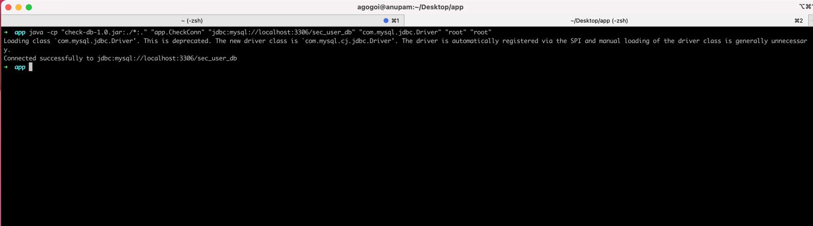

### Introduction 
A quick java tool to check the JDBC

### How To
1. Download the **/app** directory
2. Copy the necessary JDBC driver to the root folder and execute the below command.
3. Execute the below command.

```
java -cp "./*:." "app.CheckConn" "ARG1" "ARG2" "ARG3" "ARG4"
```
**ARG1**: Databases URL. E.g. *jdbc:mysql://localhost:3306/sec_user_db* 

**ARG2**: JDBC Driver class. E.g. *com.mysql.jdbc.Driver* 

**ARG3**: Username. E.g. *admin*

**ARG4**: Password. E.g. *admin* 

Example:
```
java -cp "./*:." "app.CheckConn" "jdbc:mysql://localhost:3306/sec_user_db" "com.mysql.jdbc.Driver" "root" "root"
```

Below is a sample output.
